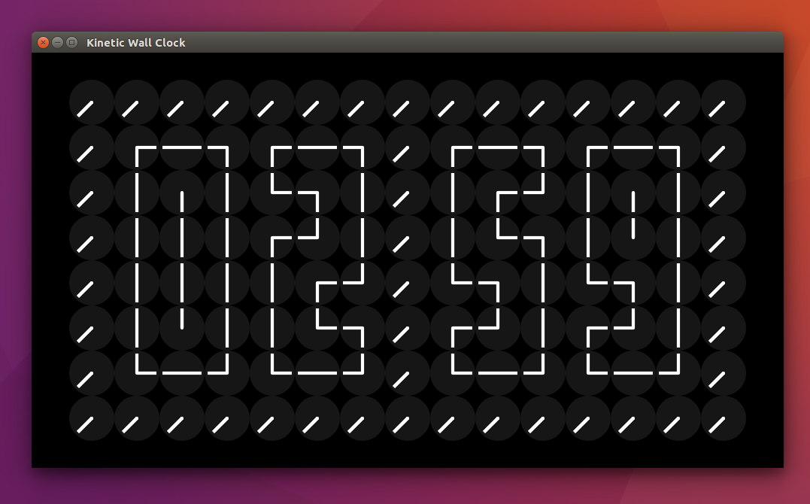

# 🕒 klokk


<a href="https://twitter.com/theapache64" target="_blank">

</a>





> A kinetic wall clock, built using Compose Multiplatform. Available on Android, Android TV, and Desktop (Windows, macOS, Linux).

## 📦 Download

Download the latest release for your platform from the [**Releases**](../../releases) page:

- **Android Mobile** - APK file
- **Android TV** - Same APK, optimized for TV experience
- **Windows** - MSI installer
- **macOS** - DMG package
- **Linux** - DEB package

## 🔮 Demo


- [Watch](https://youtu.be/ECNfa3L4U6s) full demo
- [Watch](https://www.youtube.com/watch?v=lTsZOs_PkbM) Development - Behind the Scenes - Part 1
- [Watch](https://www.youtube.com/watch?v=ejp9850FWy8) Development - Behind the Scenes - Part 2

## 🏃‍♂️ Build & Run

### Android
```bash
# Install on connected device
./gradlew :app:installDebug

# Or build APK
./gradlew :app:assembleDebug
# APK location: app/build/outputs/apk/debug/app-debug.apk
```

### Desktop
```bash
# Run directly
./gradlew :desktopApp:run

# Create installer packages
./gradlew :desktopApp:packageDmg      # macOS
./gradlew :desktopApp:packageMsi      # Windows
./gradlew :desktopApp:packageDeb      # Linux
```

## ✨ Platform Features

| Feature | Android Mobile | Android TV | Desktop |
|---------|---------------|------------|---------|
| Immersive Mode | ✅ | ✅ | ➖ |
| D-pad Navigation | ➖ | ✅ | ➖ |
| Touch Controls | ✅ | ➖ | ➖ |
| Mouse/Keyboard | ➖ | ➖ | ✅ |
| Landscape Lock | ✅ | ✅ (default) | ➖ |
| Screen Always On | ✅ | ✅ | ✅ |

## 💡 Inspiration

- Nezih Yılmaz's kinetic countdown timer
- A million times humans since 1982

## ✍️ Author

👤 **theapache64**

* Twitter: <a href="https://twitter.com/theapache64" target="_blank">@theapache64</a>
* Email: theapache64@gmail.com

Feel free to ping me 😉

## 🚀 Creating Releases

This project uses GitHub Actions to automatically build and release packages for all platforms.

### How to Create a Release:

1. Update version in `app/build.gradle.kts`
2. Commit your changes: `git commit -m "Release v1.0.2"`
3. Create and push a tag: `git tag v1.0.2 && git push origin v1.0.2`
4. GitHub Actions will automatically build and create a release

See [`.github/RELEASE_SETUP.md`](.github/RELEASE_SETUP.md) for detailed setup instructions.

## 🤝 Contributing

Contributions are what make the open source community such an amazing place to be learn, inspire, and create. Any
contributions you make are **greatly appreciated**.

1. Open an issue first to discuss what you would like to change.
1. Fork the Project
1. Create your feature branch (`git checkout -b feature/amazing-feature`)
1. Commit your changes (`git commit -m 'Add some amazing feature'`)
1. Push to the branch (`git push origin feature/amazing-feature`)
1. Open a pull request

Please make sure to update tests as appropriate.

## ❤ Show your support

Give a ⭐️ if this project helped you!

<a href="https://www.patreon.com/theapache64">
  
</a>

<a href="https://www.buymeacoffee.com/theapache64" target="_blank">
    
</a>

<a href="https://www.paypal.me/theapache64" target="_blank">
    
</a>

## ☑️ TODO

- [ ] Dark Theme Support
- [ ] Wave Movement
- [ ] Tornado Movement
- [ ] Background Music
- [x] Add second movement to border clocks
- [ ] Add alphabets

## 📝 License

```
Copyright © 2021 - theapache64

Licensed under the Apache License, Version 2.0 (the "License");
you may not use this file except in compliance with the License.
You may obtain a copy of the License at

   http://www.apache.org/licenses/LICENSE-2.0

Unless required by applicable law or agreed to in writing, software
distributed under the License is distributed on an "AS IS" BASIS,
WITHOUT WARRANTIES OR CONDITIONS OF ANY KIND, either express or implied.
See the License for the specific language governing permissions and
limitations under the License.
```

_This README was generated by [readgen](https://github.com/theapache64/readgen)_ ❤
